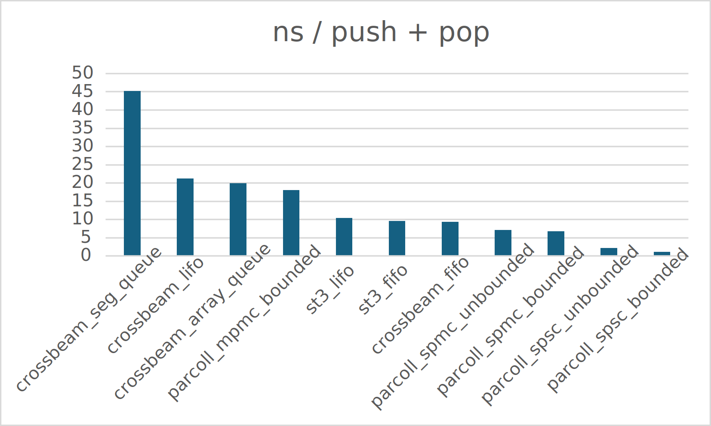
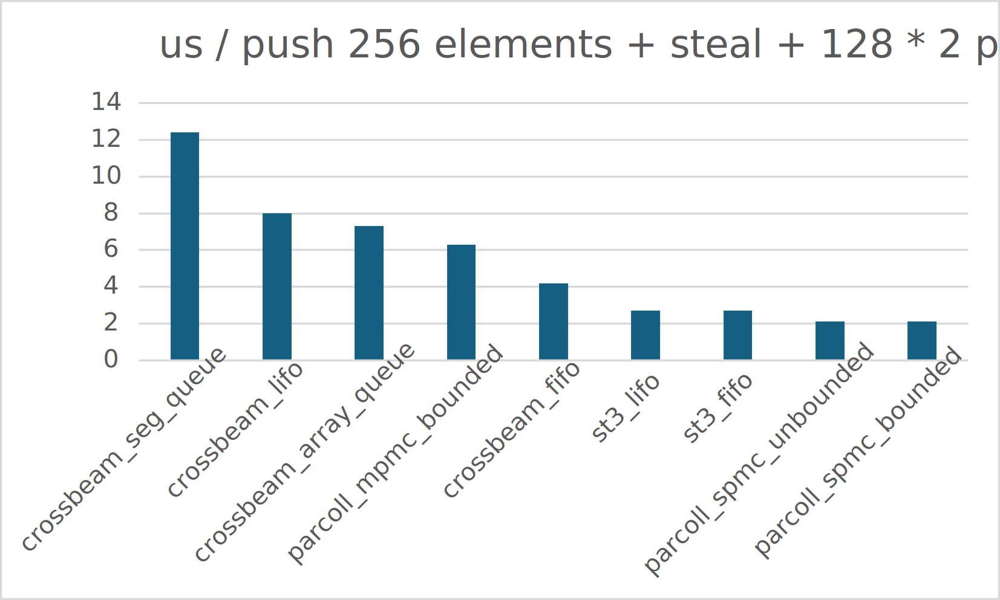

# Parcoll

This repository provides optimized collections which can be used in concurrent runtimes.

It provides optimized ring-based SPSC (const bounded or unbounded),
SPMC (const bounded or unbounded) and const bounded MPMC queues.

All queues are lock-free (or lock-free with the proper generics), generalized and can be
either be cache-padded or not.

# Usage

```rust
use parcoll::{Consumer, Producer};

fn mpmc() {
    let (producer, consumer) = parcoll::mpmc::new_cache_padded_bounded::<_, 256>();
    let producer2 = producer.clone(); // You can clone the producer
    let consumer2 = consumer.clone(); // You can clone the consumer
    
    producer.maybe_push(1).unwrap();
    producer.maybe_push(2).unwrap();
    
    let mut slice = [std::mem::MaybeUninit::uninit(); 3];
    let popped = consumer.pop_many(&mut slice);
    
    assert_eq!(popped, 2);
    assert_eq!(unsafe { slice[0].assume_init() }, 1);
    assert_eq!(unsafe { slice[1].assume_init() }, 2);
}

fn spsc_unbounded() {
    let (producer, consumer) = parcoll::spsc::new_cache_padded_unbounded();
    
    producer.maybe_push(1).unwrap();
    producer.maybe_push(2).unwrap();
    
    let mut slice = [std::mem::MaybeUninit::uninit(); 3];
    let popped = consumer.pop_many(&mut slice);
    
    assert_eq!(popped, 2);
    assert_eq!(unsafe { slice[0].assume_init() }, 1);
    assert_eq!(unsafe { slice[1].assume_init() }, 2);
}

fn spmc() {
    let (producer1, consumer1) = parcoll::spmc::new_bounded::<_, 256>();
    let (producer2, consumer2) = parcoll::spmc::new_bounded::<_, 256>();
    let consumer3 = consumer2.clone(); // You can clone the consumer
    
    for i in 0..100 {
        producer1.maybe_push(i).unwrap();
    }
    
    consumer1.steal_into(&producer2);
    
    assert_eq!(producer2.len(), 50);
    assert_eq!(consumer1.len(), 50);
}
```

# Benchmarks

## Push + Pop (ns/op)



# Push * 256 + steal + Pop * 256 (us/op)



# Optimizations

All queues are optimized as much as possible (or we think so). It includes:

- cache-padding (not alignment);
- caching of atomics values where it makes sense;
- using as low CAS as possible.

# Features

- `with-light-qsbr`: Enables [light-qsbr](https://github.com/orengine/light-qsbr) support.
- `unbounded_slices_always_pow2`: Ensures that unbounded slices are always power of two
  (it leads to more memory usage, but improves performance).
- `always_steal`: Always steals from the other queue when possible 
  (by default, it may not steal if the source queue has less than four elements).
- `untested_memory_ordering`: Enables "untested" memory orderings.
  Honestly, they pass tests, but we didn't test them with very weak memory ordering (like the abstract machine).
  They seem correct and improve performance.

If you have any idea how to make it even better, please let us know 
(create either an issue or a pull request).
